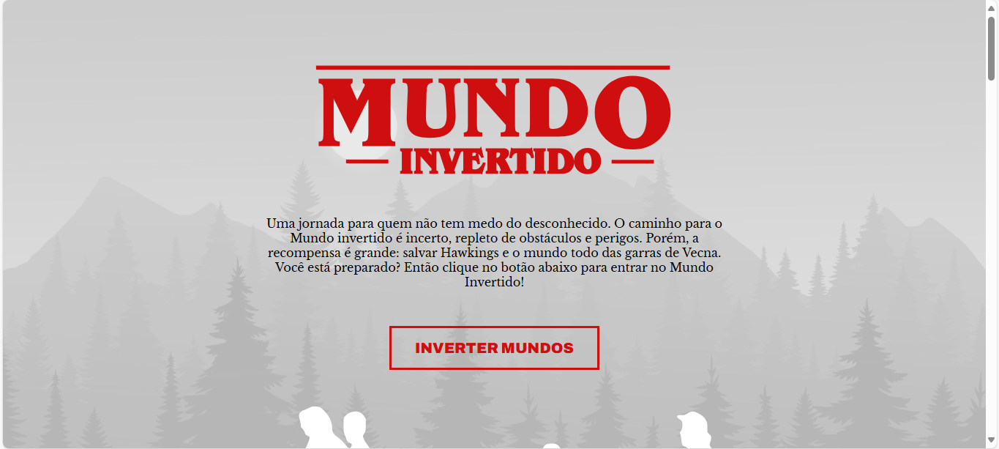
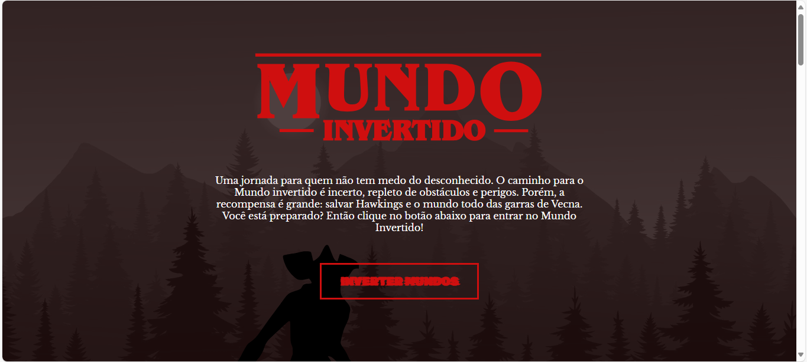

# 🌌 **Mundo Invertido - Uma Experiência Interativa de Stranger Things**  

**Explore os mistérios de Hawkins em uma landing page imersiva que alterna entre o mundo real e o Mundo Invertido!**  

---

## 🚀 **Sobre o Projeto**  

Inspirado na icônica série *Stranger Things*, este projeto é uma landing page interativa que permite aos usuários "inverter" entre o mundo normal e o Mundo Invertido com um simples clique. Desenvolvido como parte do **Bootcamp de Frontend da DIO**, o objetivo foi praticar **HTML, CSS e JavaScript** de forma criativa, aplicando conceitos como:  

- **Troca de temas dinâmica** (light/dark mode)  
- **Efeitos visuais imersivos**  
- **Reprodução de áudio temático**  
- **Design responsivo**  

---

## ✨ **Recursos e Funcionalidades**  

### 🔄 **Alternância entre Mundos**  
- **Botão interativo** que muda todo o estilo da página, incluindo:  
  - Cores e tipografia  
  - Imagens dos personagens  
  - Música de fundo (mundo normal vs. Mundo Invertido)  

### 🎵 **Atmosfera Sonora**  
- Trilha sonora automática (*normal-world.mpeg* / *inverted-world.mpeg*)  
- Volume ajustado para uma experiência imersiva  

### 🖼️ **Galeria de Imagens**  
- Destaque para cenas e personagens marcantes da série  
- Efeitos visuais ao passar o mouse  

### 📝 **Formulário do Clube D&D**  
- Simulação de inscrição para o clube de *Dungeons & Dragons*  
- Estilização temática com efeitos de borda  

### 📱 **Design Responsivo**  
- Adaptável para diferentes tamanhos de tela  
- Uso de **Flexbox** e **CSS moderno**  

---

## 🛠️ **Tecnologias Utilizadas**  

| **Frontend**  | **Descrição** |  
|--------------|--------------|  
|  | Estrutura semântica |  
|  | Estilos com variáveis e temas |  
|  | Interatividade e troca de temas |  

---

## 🎥 **Preview**  

### **🌞 Mundo Normal**  


### **🌑 Mundo Invertido**  
 

---

## 📥 **Como Executar**  

1. **Clone o repositório**  
   ```bash
   git clone https://github.com/seu-usuario/mundo-invertido.git
   ```
2. **Abra o arquivo `index.html`** no navegador  
3. **Clique no botão "Inverter Mundos"** para alternar entre os temas  

---

**🔮 Prepare-se para entrar no Mundo Invertido... se você se atreve!**  
